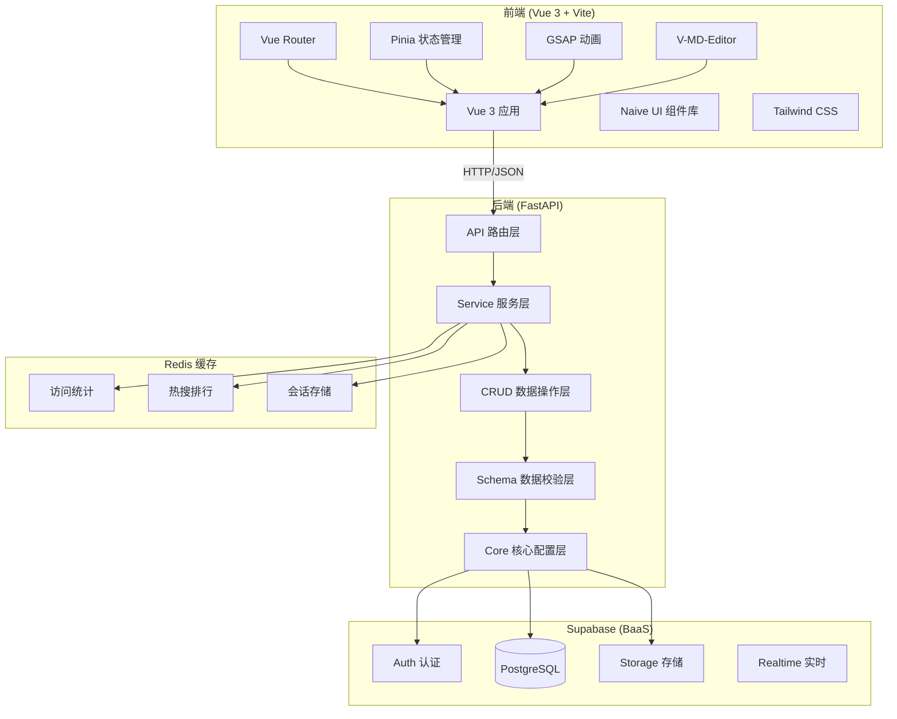
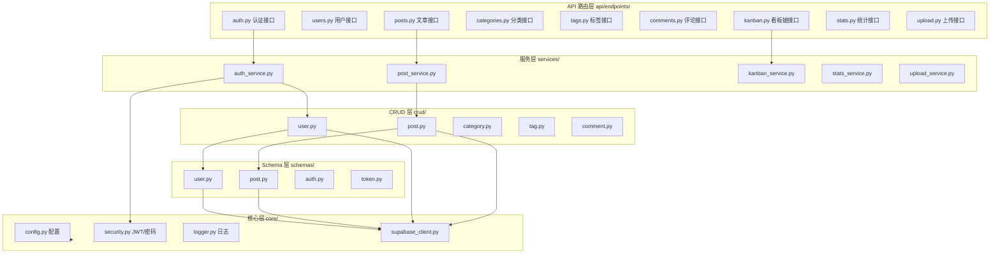
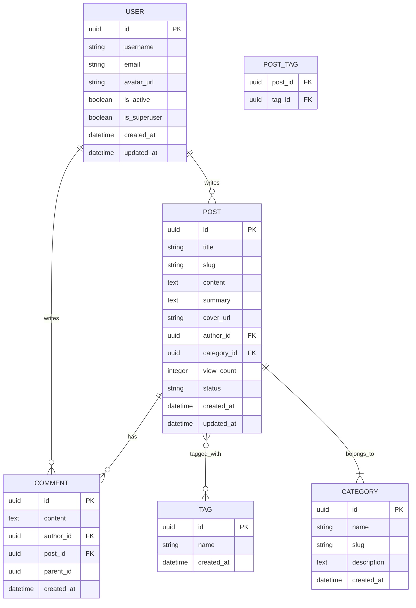
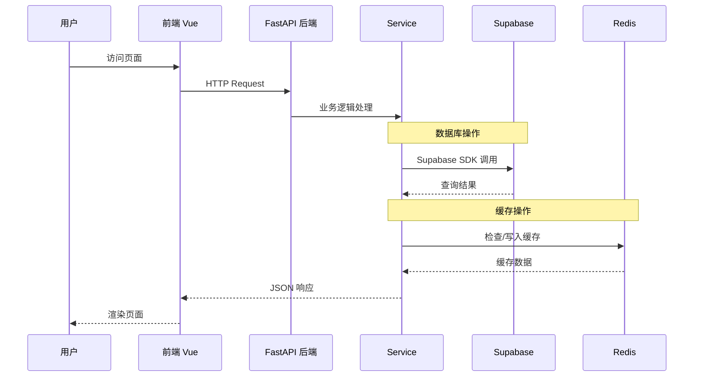

# ACG Blog 开发路径

> 二次元风格博客系统 - 分阶段开发计划
>
> **最后更新**：2026-03-24
>
> **当前状态**：前端基础搭建完成 ✅ | 后端开发未开始 ❌

---

## 系统架构设计

### 整体架构图



### 前端模块架构

```mermaid
graph TB
    subgraph Views["页面视图"]
        Home[首页 Home.vue]
        PostDetail[文章详情 PostDetail.vue]
        Category[分类页 Category.vue]
        Archive[归档页 Archive.vue]
        About[关于页 About.vue]
    end

    subgraph Auth["认证模块"]
        Login[登录 Login.vue]
        Register[注册 Register.vue]
        Profile[个人资料 Profile.vue]
    end

    subgraph Admin["管理后台"]
        Dashboard[仪表盘 Dashboard.vue]
        PostManage[文章管理 PostManage.vue]
        CategoryManage[分类管理 CategoryManage.vue]
        TagManage[标签管理 TagManage.vue]
    end

    subgraph Components["公共组件"]
        Navbar[导航栏 Navbar.vue]
        Hero[Hero 区域 Hero.vue]
        Footer[页脚 Footer.vue]
        PostCard[文章卡片 PostCard.vue]
        Sidebar[侧边栏 Sidebar.vue]
        Kanban[看板娘 Kanban.vue]
    end

    subgraph Store["状态管理"]
        UserStore[user.ts 用户状态]
        ThemeStore[theme.ts 主题状态]
        KanbanStore[kanban.ts 看板娘状态]
    end

    subgraph API["接口层"]
        AuthAPI[auth.ts 认证接口]
        PostAPI[post.ts 文章接口]
        IndexAPI[index.ts 基础配置]
    end

    Navbar --> Home
    Hero --> Home
    PostCard --> Home
    Sidebar --> Home
    Footer --> Views
    Home --> PostDetail
    Home --> Category
    Login --> Auth
    Register --> Auth
    Profile --> Auth
    Dashboard --> Admin
    PostManage --> Admin
    UserStore --> Store
    ThemeStore --> Store
    AuthAPI --> API
    PostAPI --> API
```



### 后端模块架构



### 数据库模型关系图 (Supabase PostgreSQL)



### 数据流架构图



---

## 开发阶段

### 阶段一：后端基础架构搭建

**优先级：P0** | **状态：❌ 未开始**

#### 1.1 核心配置层
- [ ] `core/config.py` - 环境变量与全局配置（Pydantic Settings）
- [ ] `core/supabase.py` - Supabase 客户端初始化
- [ ] `core/security.py` - JWT 生成、验证与密码哈希（python-jose + passlib）
- [ ] `core/logger.py` - Loguru 日志配置
- [ ] `.env.example` - 环境变量模板

#### 1.2 数据库表结构 (Supabase PostgreSQL)
- [ ] 创建 profiles 表（用户扩展信息）
- [ ] 创建 posts 表（文章）
- [ ] 创建 categories 表（分类）
- [ ] 创建 tags 表（标签）
- [ ] 创建 comments 表（评论）
- [ ] 创建 post_tags 表（文章-标签关联）
- [ ] 配置 RLS (Row Level Security) 策略
- [ ] 设计数据库索引

#### 1.3 Pydantic Schema 层
- [ ] `schemas/user.py` - 用户数据验证
- [ ] `schemas/post.py` - 文章数据验证
- [ ] `schemas/auth.py` - 认证相关 Schema
- [ ] `schemas/token.py` - Token Schema

#### 1.4 CRUD 操作层
- [ ] `crud/user.py` - 用户 CRUD（通过 Supabase SDK）
- [ ] `crud/post.py` - 文章 CRUD
- [ ] `crud/category.py` - 分类 CRUD
- [ ] `crud/tag.py` - 标签 CRUD
- [ ] `crud/comment.py` - 评论 CRUD

---

### 阶段二：认证与用户模块

**优先级：P0** | **状态：❌ 未开始**

#### 2.1 认证接口
- [ ] `api/endpoints/auth.py`
  - [ ] POST `/api/v1/auth/register` - 用户注册
  - [ ] POST `/api/v1/auth/login` - 用户登录
  - [ ] POST `/api/v1/auth/refresh` - 刷新 Token
  - [ ] POST `/api/v1/auth/logout` - 用户登出

#### 2.2 用户管理接口
- [ ] `api/endpoints/users.py`
  - [ ] GET `/api/v1/users/me` - 获取当前用户信息
  - [ ] PUT `/api/v1/users/me` - 更新当前用户信息
  - [ ] PUT `/api/v1/users/me/password` - 修改密码

#### 2.3 依赖注入与中间件
- [ ] `api/deps.py` - 依赖注入（获取当前用户等）
- [ ] JWT 认证中间件

---

### 阶段三：文章管理模块

**优先级：P1** | **状态：❌ 未开始**

#### 3.1 文章接口
- [ ] `api/endpoints/posts.py`
  - [ ] GET `/api/v1/posts/` - 文章列表（分页）
  - [ ] GET `/api/v1/posts/{post_id}` - 获取单篇文章
  - [ ] POST `/api/v1/posts/` - 创建文章（需认证）
  - [ ] PUT `/api/v1/posts/{post_id}` - 更新文章
  - [ ] DELETE `/api/v1/posts/{post_id}` - 删除文章
  - [ ] POST `/api/v1/posts/{post_id}/view` - 增加浏览量

#### 3.2 分类与标签接口
- [ ] `api/endpoints/categories.py`
  - [ ] GET `/api/v1/categories/` - 分类列表
  - [ ] POST `/api/v1/categories/` - 创建分类（管理员）
- [ ] `api/endpoints/tags.py`
  - [ ] GET `/api/v1/tags/` - 标签列表
  - [ ] POST `/api/v1/tags/` - 创建标签（管理员）

#### 3.3 评论接口
- [ ] `api/endpoints/comments.py`
  - [ ] GET `/api/v1/posts/{post_id}/comments` - 获取文章评论
  - [ ] POST `/api/v1/posts/{post_id}/comments` - 发表评论
  - [ ] DELETE `/api/v1/comments/{comment_id}` - 删除评论

---

### 阶段四：特色功能开发

**优先级：P3** | **状态：❌ 未开始**

#### 4.1 看板娘系统
- [ ] `services/kanban_service.py` - 看板娘互动逻辑
- [ ] `api/endpoints/kanban.py`
  - [ ] GET `/api/v1/kanban/greeting` - 随机问候语
  - [ ] POST `/api/v1/kanban/mood` - 切换看板娘心情
  - [ ] GET `/api/v1/kanban/stats` - 看板娘统计信息

#### 4.2 统计与热搜
- [ ] Redis 缓存集成
- [ ] `services/stats_service.py` - 访问统计逻辑
- [ ] `api/endpoints/stats.py`
  - [ ] GET `/api/v1/stats/hot-posts` - 热搜文章排行
  - [ ] GET `/api/v1/stats/visits` - 访问量统计
  - [ ] GET `/api/v1/stats/archive` - 归档统计

#### 4.3 文件上传
- [ ] `services/upload_service.py` - 图片上传处理
- [ ] `api/endpoints/upload.py`
  - [ ] POST `/api/v1/upload/image` - 上传图片
  - [ ] 图片压缩与缩略图生成（Pillow）

---

### 阶段五：前端项目初始化

**优先级：P1** | **状态：✅ 已完成**

#### 5.1 基础搭建 ✅
- [x] Vite + Vue 3 项目初始化
- [x] 配置 Tailwind CSS v4
- [x] 配置 Naive UI 主题（二次元配色）
- [x] 配置路由（Vue Router）

#### 5.2 状态管理 ✅
- [x] Pinia Store 结构设计
- [x] `store/user.ts` - 用户状态
- [x] `store/theme.ts` - 主题状态
- [ ] `store/kanban.ts` - 看板娘状态

#### 5.3 API 封装 ✅
- [x] Axios 基础配置
- [x] 请求/响应拦截器（JWT 处理）
- [x] API 模块化封装

---

### 阶段六：前端核心页面

**优先级：P2** | **状态：⚠️ 部分完成**

#### 6.1 布局组件 ✅
- [x] `layouts/AdminLayout.vue` - 管理后台布局
- [x] `components/Navbar.vue` - 导航栏
- [x] `components/Footer.vue` - 页脚
- [x] `components/Hero.vue` - Hero 区域

#### 6.2 公共组件 ⚠️
- [ ] `components/Kanban.vue` - Live2D 看板娘
- [x] `components/PostCard.vue` - 文章卡片
- [ ] `components/MarkdownEditor.vue` - Markdown 编辑器
- [x] `components/Sidebar.vue` - 侧边栏

#### 6.3 核心页面 ⚠️
- [x] `views/Home.vue` - 首页（文章列表）
- [x] `views/PostDetail.vue` - 文章详情（占位）
- [x] `views/Category.vue` - 分类页（占位）
- [ ] `views/Archive.vue` - 归档页
- [x] `views/About.vue` - 关于页（占位）

---

### 阶段七：用户功能页面

**优先级：P2** | **状态：⚠️ 部分完成**

#### 7.1 认证页面 ⚠️
- [x] `views/auth/Login.vue` - 登录页（框架）
- [x] `views/auth/Register.vue` - 注册页（框架）

#### 7.2 用户中心 ⚠️
- [x] `views/user/Profile.vue` - 个人资料（框架）
- [ ] `views/user/Settings.vue` - 用户设置
- [ ] `views/user/MyPosts.vue` - 我的文章

---

### 阶段八：管理后台

**优先级：P3** | **状态：⚠️ 部分完成**

#### 8.1 后台布局 ✅
- [x] `admin/Dashboard.vue` - 仪表盘（框架）
- [x] `admin/Sidebar.vue` - 侧边栏（在 AdminLayout 中）

#### 8.2 后台功能 ⚠️
- [x] `admin/PostManage.vue` - 文章管理（框架）
- [x] `admin/CategoryManage.vue` - 分类管理（框架）
- [x] `admin/TagManage.vue` - 标签管理（框架）
- [ ] `admin/CommentManage.vue` - 评论管理
- [ ] `admin/UserManage.vue` - 用户管理
- [ ] `admin/Statistics.vue` - 数据统计

---

### 阶段九：动效与优化

**优先级：P4** | **状态：⚠️ 部分完成**

#### 9.1 动画效果 ⚠️
- [ ] GSAP 页面转场动画
- [x] 卡片悬浮效果 ✅
- [ ] 看板娘互动动画
- [x] 毛玻璃特效实现 ✅

#### 9.2 性能优化
- [ ] 图片懒加载
- [x] 路由懒加载
- [ ] API 请求防抖节流
- [ ] 前端缓存策略

---

### 阶段十：测试与部署

**优先级：P5** | **状态：❌ 未开始**

#### 10.1 测试
- [ ] 后端单元测试（pytest）
- [ ] API 集成测试
- [ ] 前端组件测试（Vitest）

#### 10.2 部署配置
- [ ] `Dockerfile`（后端）
- [ ] `Dockerfile`（前端）
- [ ] `docker-compose.yml` - 完整编排
- [ ] Nginx 配置
- [ ] CI/CD 流程

---

## 项目结构（当前）

```
ACG-Blog/
├── backend/
│   ├── app/
│   │   ├── api/
│   │   │   └── endpoints/        # API 路由
│   │   │       ├── auth.py       # 认证接口
│   │   │       ├── users.py      # 用户接口
│   │   │       ├── posts.py      # 文章接口
│   │   │       ├── categories.py # 分类接口
│   │   │       ├── tags.py       # 标签接口
│   │   │       ├── comments.py   # 评论接口
│   │   │       ├── kanban.py     # 看板娘接口
│   │   │       ├── stats.py      # 统计接口
│   │   │       └── upload.py     # 上传接口
│   │   ├── core/                 # 核心配置
│   │   │   ├── config.py        # 环境变量配置
│   │   │   ├── supabase.py      # Supabase 客户端
│   │   │   ├── security.py      # JWT/密码安全
│   │   │   └── logger.py        # 日志配置
│   │   ├── crud/                 # CRUD 操作
│   │   │   ├── user.py
│   │   │   ├── post.py
│   │   │   ├── category.py
│   │   │   ├── tag.py
│   │   │   └── comment.py
│   │   ├── models/               # 数据模型（Pydantic）
│   │   │   ├── user.py
│   │   │   ├── post.py
│   │   │   ├── category.py
│   │   │   ├── tag.py
│   │   │   └── comment.py
│   │   ├── schemas/              # Pydantic Schema
│   │   │   ├── auth.py
│   │   │   ├── token.py
│   │   │   └── ...
│   │   └── services/             # 业务服务
│   │       ├── kanban_service.py
│   │       ├── stats_service.py
│   │       └── upload_service.py
│   ├── main.py                   # FastAPI 入口
│   ├── requirements.txt           # Python 依赖
│   └── venv/                     # 虚拟环境
│
├── frontend/
│   ├── public/                   # 静态资源
│   │   ├── favicon.svg
│   │   ├── icons.svg
│   │   └── live2d/             # Live2D 模型文件
│   ├── src/
│   │   ├── api/                  # API 封装 ✅
│   │   │   ├── index.ts          # Axios 配置
│   │   │   ├── auth.ts           # 认证接口
│   │   │   └── post.ts           # 文章接口
│   │   ├── assets/               # 静态资源
│   │   ├── components/           # 公共组件 ✅
│   │   │   ├── Footer.vue
│   │   │   ├── Hero.vue
│   │   │   ├── Kanban.vue       # 看板娘组件
│   │   │   ├── Navbar.vue
│   │   │   ├── PostCard.vue
│   │   │   └── Sidebar.vue
│   │   ├── layouts/              # 布局组件
│   │   │   └── AdminLayout.vue
│   │   ├── router/               # 路由配置
│   │   ├── store/                # 状态管理 ✅
│   │   ├── views/                # 页面视图
│   │   ├── App.vue
│   │   ├── main.ts
│   │   └── style.css
│   ├── package.json
│   ├── tsconfig.json
│   ├── vite.config.ts
│   ├── tailwind.config.js
│   └── postcss.config.js
│
├── docker-compose.yml            # Docker 编排
├── README.md
└── 开发路径.md
```

---

## 技术栈汇总

### 后端技术
| 技术 | 版本 | 用途 |
|------|------|------|
| Python | 3.11+ | 运行环境 |
| FastAPI | 0.110.0 | Web 框架 |
| Uvicorn | 0.27.1 | ASGI 服务器 |
| **Supabase** | - | BaaS 平台（内置 Auth + PostgreSQL + Storage） |
| Redis | - | 缓存/会话（热搜排行、访问统计） |
| Pydantic | 2.6.3 | 数据校验 |
| python-jose | 3.3.0 | JWT 认证 |
| Passlib | 1.7.4 | 密码哈希 |
| Loguru | 0.7.2 | 日志 |
| Pillow | 10.2.0 | 图片处理 |
| httpx | 0.27.0 | 异步 HTTP |
| python-multipart | 0.0.9 | 文件上传 |

### 前端技术
| 技术 | 版本 | 用途 |
|------|------|------|
| Vue | 3.5.30 | 框架 |
| Vite | 8.0.0 | 构建工具 |
| TypeScript | 5.9.3 | 类型系统 |
| Vue Router | 5.0.3 | 路由 |
| Pinia | 3.0.4 | 状态管理 |
| Naive UI | 2.44.1 | UI 组件库 |
| Tailwind CSS | 4.2.1 | CSS 框架 |
| Axios | 1.13.6 | HTTP 客户端 |
| @vueuse/core | 14.2.1 | Vue 组合式工具 |
| **GSAP** | - | 动画库（页面转场、交互动画） |
| **V-MD-Editor** | - | Markdown 编辑器 |

---

## 优先级建议

| 优先级 | 阶段 | 说明 | 状态 |
|--------|------|------|------|
| P0 | 一、二 | 后端基础 + 认证系统（核心） | ❌ 未开始 |
| P1 | 三、五 | 文章管理 + 前端初始化 | ❌ / ⚠️ |
| P2 | 六、七 | 核心页面 + 用户功能 | ⚠️ 部分完成 |
| P3 | 四、八 | 特色功能 + 管理后台 | ❌ / ⚠️ |
| P4 | 九 | 动效优化 | ⚠️ 部分完成 |
| P5 | 十 | 测试与部署 | ❌ 未开始 |

---

## 下一步开发计划

根据当前项目状态，建议按以下顺序继续开发：

### 立即执行（Next Step）
1. **完成后端核心配置** (`core/config.py`, `core/security.py`)
2. **创建数据库模型** (`models/`)
3. **实现认证接口** (`api/endpoints/auth.py`)
4. **前后端 API 对接**

### 看板娘集成（可选）
- 可使用 Live2D Cubism SDK 或 `vue-live2d` 等第三方库

---

## 注意事项

1. **Supabase**：使用 Supabase 作为 BaaS 平台，内置 Auth、PostgreSQL、Storage
2. **环境变量**：敏感信息（Supabase URL、anon key、JWT密钥）必须通过 `.env` 管理
3. **前端主题**：使用二次元风格的配色（粉色 #FFB7C5、浅蓝 #A8D8EA、紫色 #D4B5E6）
4. **看板娘**：可使用 Live2D Cubism SDK 或第三方开源实现（如 vue-live2d）
5. **图片处理**：确保上传的图片有合适的压缩和尺寸限制（Pillow）
6. **Tailwind 4.x**：注意 `@apply` 指令使用限制，优先使用 CSS 原生语法
7. **Redis**：用于缓存热搜排行、访问统计等高频访问数据

---

*文档版本：v2.0 | 更新日期：2026-03-24*
